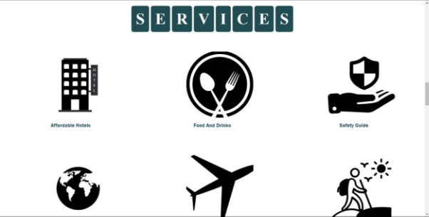

Travel and Tourism websiTe  

Welcome to our travel and tourism website! Our site is designed to provide you with a seamless and enjoyable experience as you explore destinations and plan your next adventure. Whether you're looking for inspiration, tips, or booking services, we've got you covered. 

**Features** 

**Responsive Design** 

Our website is fully responsive, ensuring that it looks great and functions perfectly on various devices, including desktops, laptops, tablets, and smartphones. You can browse and plan your travels from anywhere, anytime. 

**Smooth Scrolling** 

We've implemented smooth scrolling to enhance your browsing experience. As you navigate through different website sections, the transition is seamless and visually appealing. 

**Fixed Navigation Bar** 

The fixed navigation bar at the top of the page stays visible as you scroll, making it easy to access different sections of the website without having to scroll back to the top. This feature provides convenient navigation, especially on longer pages. 

**Mobile-Friendly Menu Icon** 

On smaller screens, such as smartphones and tablets, a mobile-friendly menu icon is displayed. Clicking on this icon reveals a menu with links to different sections of the website, allowing for easy navigation on devices with limited screen space. 

**Slideshow of Travel Experiences** 

Our website features a slideshow that showcases various travel experiences. This dynamic element adds visual interest to the website and highlights the diversity of destinations and activities available to travellers. 

**Technologies Used**

Our website is built using the following technologies: 

- **HTML5**: For the structure and content of the website.
- **CSS3**: For styling and layout, including animations and transitions. 
- **JavaScript**: For interactive elements and functionality, such as smooth scrolling and the slideshow. 

**Usage**
To view our website, simply open the **signup.html** file in your web browser. From there, you can explore the different sections of the website, read about travel experiences, and start planning your next trip! 

**Credits** 

We would like to thank the following for their contributions to our website: 

- **Font Awesome**: For providing the icons used in the navigation bar and throughout the site. 

Home secTion: 

booK secTion: 

PacKages secTion: 

services secTion: 

gallery secTion: 

exPeriences secTion: 

conTacT secTion: 

FooTer; 

